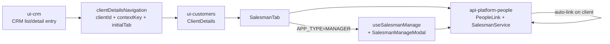

# Cliente × Vendedor — vínculo e permissões

Documentação técnica do papel de **`ui-customers`** no fluxo de vínculo cliente↔vendedor (trilha `ui-crm#2` + gestão administrativa `ui-customers#20`).

## Como este módulo se encaixa

| Visão (`APP_TYPE`) | Uso de `ui-customers` neste fluxo |
| --- | --- |
| **CRM** | Recebe handoff do `ui-crm` e mostra o detalhe do cliente; lista o vendedor **sem** gestão administrativa (sem botão +, edit, delete, modal) |
| **MANAGER** | Detalhe administrativo: vincular, editar, remover vendedores; ver e editar comissão / mínimo (conforme regras de role) |
| Outros (POS, etc.) | Reutilizam o detalhe conforme permissão; não assumem regras comerciais do CRM nem CRUD de vendedores |

Página canônica do fluxo completo (CRM / backend):  
- [ui-crm — Cliente × Vendedor](https://github.com/ControleOnline/ui-crm/wiki/Cliente-Vendedor-Vinculo-e-Permissoes)  
- [api-platform-people — Cliente × Vendedor](https://github.com/ControleOnline/api-platform-people/wiki/Cliente-Vendedor-Vinculo-e-Permissoes)

## Objetivo

Registrar regras de negócio, modularização e contratos da aba **Vendedores** no detalhe do cliente:

1. listagem de vínculos `sellers-client` via store `people_link`;
2. gestão administrativa (vincular / editar / remover) **somente** quando `APP_TYPE=MANAGER`;
3. edição de comissão / mínimo (override) restrita a roles adequadas (`ROLE_SUPER` / `ROLE_OWNER` em MANAGER);
4. modularização dos componentes ≤ 500 linhas e testes focais.

## Repositórios afetados

| Módulo | Papel no fluxo |
| --- | --- |
| `ui-crm` | Handoff do CRM para o detalhe do cliente com contexto de vendedores |
| `ui-customers` | Aba `Vendedores` no detalhe do cliente (listagem + gestão UI) |
| `api-platform-people` | Vínculo automático, distribuição de vendedores e recurso `people_link` |
| `app-community` | Fronteira de apps (`MANAGER` vs `CRM`) em `MODOS_OPERACAO.md` |

## Regras de negócio (UI)

### Permissões por app

| Capacidade | `APP_TYPE=MANAGER` | Fora de `MANAGER` (ex.: CRM) |
| --- | --- | --- |
| Ver quem é o vendedor vinculado | sim | sim |
| Botão **+** (vincular novo) | sim | não |
| Edit / delete por linha | sim | não |
| Modal de gestão (picker + comissão / mínimo) | sim | não |
| Ver % de comissão / mínimo | sim | não |
| Editar comissão (override) | sim (ROLE_SUPER / ROLE_OWNER) | não |

A fronteira oficial de **CRUD administrativo** é por **app** (`APP_TYPE === MANAGER`), via helper `canManageSalesmen(appType)`. A UI **não** é o enforcement final — escrita em `people_link` e comissão devem ser filtradas no backend.

### Modelo de dados (vínculos)

- `PeopleLink` com `linkType`:
  - `client` — empresa ↔ cliente
  - `salesman` — empresa ↔ vendedor
  - `sellers-client` — vendedor ↔ cliente
- Campos sensíveis no vínculo: `comission`, `minimum_comission`

### Fluxo de gestão (MANAGER)

1. `SalesmanTab` carrega vínculos `sellers-client` do cliente.
2. Se `canManageSalesmen(appType)`:
   - exibe botão **+** (`salesman-manage-add-btn`);
   - por linha: ações de editar e remover;
   - abre `SalesmanManageModal` com picker de vendedores da empresa (já com `linkType=salesman`) e campos de comissão / mínimo.
3. Save usa `people_link` actions (`save` / `remove`) com payload montado por `buildSalesmanSavePayload`.
4. Fora de MANAGER: apenas listagem + navegação para o detalhe da pessoa vinculada; nenhum controle de CRUD.

## Modularização (`ui-customers`)

Arquivos principais (todos ≤ 500 linhas):

| Arquivo | Responsabilidade |
| --- | --- |
| `src/react/components/tabs/SalesmanTab.js` | Aba: listagem, gate MANAGER, integração com modal e bloco de comissão |
| `src/react/components/tabs/useSalesmanManage.js` | Hook de gestão administrativa (load options, open/save/remove modal state) |
| `src/react/components/tabs/SalesmanManageModal.js` | Modal de vincular/editar (picker + comissão / mínimo) |
| `src/react/components/tabs/SalesmanCommissionBlock.js` | Bloco de exibição/edição de comissão (override por role) |
| `src/react/components/tabs/salesmanTab.helpers.js` | Helpers puros: `canManageSalesmen`, normalize, options, save payload |
| `src/react/components/tabs/salesmanTabHelpers.js` | Helpers de comissão / display (legado + override) |
| `src/react/components/tabs/salesmanTabMedia.js` | Media / avatar collection helpers |
| `src/react/components/tabs/salesmanTabSession.js` | `resolveAppType` (localStorage `app-type`) e session user |

Gate principal:

```js
export const canManageSalesmen = appType =>
  normalizeAppType(appType) === 'MANAGER';
```

`APP_TYPE` é lido de `localStorage.getItem('app-type')` via `resolveAppType()`.

## Contratos com outros módulos

| Origem | Expectativa |
| --- | --- |
| `ui-crm` | chega com `clientId`, `contextKey=client`, opcionalmente `initialTab=sellers` |
| `api-platform-people` | leitura/escrita de `people_link`; vínculo automático e campos de comissão; enforcement no backend |
| `app-community` | composição do submodule; `MODOS_OPERACAO.md` define fronteira MANAGER vs CRM |



## Segurança (pontos de atenção)

1. Restrição de CRUD e comissão fora de `MANAGER` **não** pode depender só de UI.
2. Escrita em `people_link` deve respeitar menor privilégio (evitar que “pode ler” vire “pode escrever” em outros `linkType`).
3. Escopo multiempresa: gestor de uma empresa não deve herdar gestão de `sellers-client` de outra empresa só porque o vendedor é compartilhado.
4. Commission override continua nas regras já aceitas (`ui-customers#10` / `#12`); manage não amplia privilégio além do contexto MANAGER.

## Testes

- Unit: `npm run test:salesman-tab` (helpers + gate `canManageSalesmen`).
- Browser smoke (MANAGER):
  - `src/tests/browser/manager/client-details-salesman-manage.spec.js` — + / edit / delete + modal.
  - `src/tests/browser/manager/client-details-salesman-commission.spec.js` — comissão.
- non-MANAGER: ausência de controles CRUD coberta nos smokes.

## Instalação / operação

Não há pacote isolado. O fluxo depende dos submódulos front (`ui-crm`, `ui-customers`) compostos no app e do módulo PHP `api-platform-people` na API.

Config relevante por empresa (backend):

- chave `salesman-distribution-strategy` (default `random`)

## Manutenção

Ao alterar este fluxo:

1. atualizar esta página e as cópias nos módulos afetados (`docs/technical/` + wiki);
2. manter testes focais de helpers da aba e smoke MANAGER vs non-MANAGER;
3. validar enforcement de `people_link` no backend antes de liberar exposição de comissão ou CRUD.

## Referências internas

- Issues: `ControleOnline/ui-crm#2` (fluxo original), `ControleOnline/ui-customers#20` (gestão administrativa MANAGER), `#10` / `#12` (comissão)
- PRs históricos: `ui-customers#3`, `ui-crm#10`, `api-platform-people#4`
- Fronteira de apps: [app-community/MODOS_OPERACAO.md](https://github.com/ControleOnline/app-community/blob/master/MODOS_OPERACAO.md)
- Cópia versionada no Git: `docs/technical/Cliente-Vendedor-Vinculo-e-Permissoes.md`
